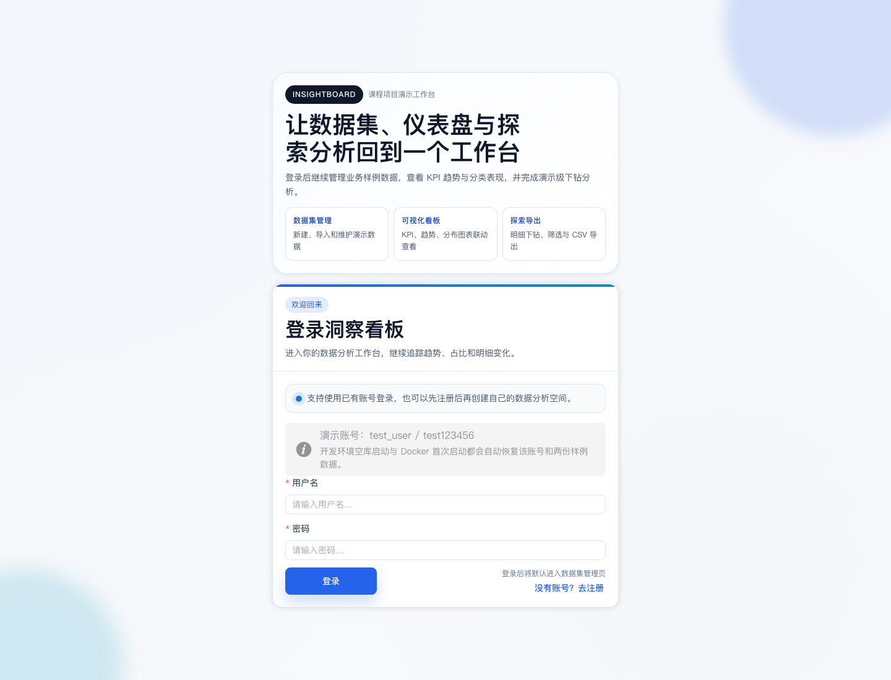
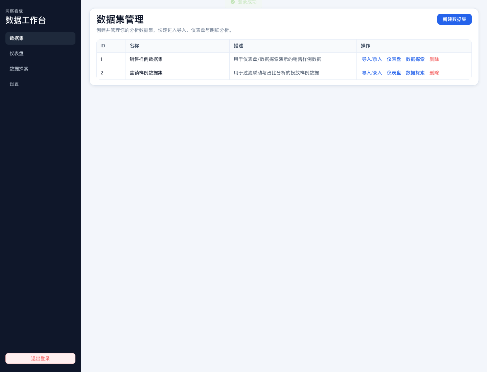
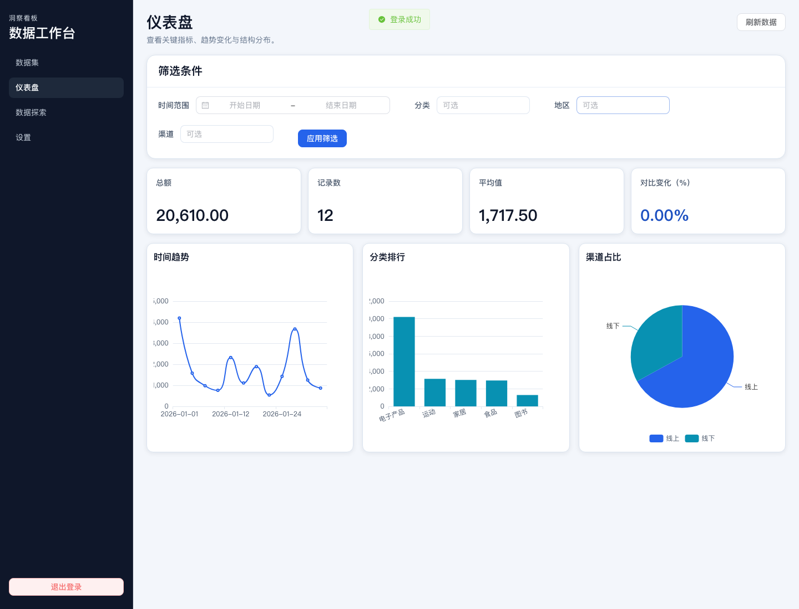

# InsightBoard MVP

InsightBoard 是一个面向课程项目的数据可视化全栈应用，支持数据录入/导入、统计分析、图表展示、明细下钻。


## 功能模块

1. **Auth**：注册、登录、退出、登录态持久化、路由守卫。
2. **Datasets**：数据集创建、列表展示、删除。
3. **Records**：单条录入、CSV 文本批量导入、分页筛选。
4. **Dashboard**：3 KPI + 折线/柱状/饼图，支持筛选联动。
5. **Explore**：明细分页、图表下钻、CSV 导出。
6. **Settings**：暗黑主题 + 主题色切换（`localStorage` 持久化）。

## 技术栈

- Frontend: Vue 3 + TypeScript + Vite + Vue Router + Pinia + Axios + Element Plus + ECharts
- Backend: NestJS + TypeORM + SQLite + JWT
- Test: Vitest + Jest/Supertest + Playwright
- Deploy: Docker Compose

## 目录结构

```text
.
├─ frontend/
├─ backend/
├─ docs/
├─ e2e/
├─ docker-compose.yml
└─ README.md
```

## 代码架构

### 前端架构（Vue 3 + Composition API）

- **路由层**：`frontend/src/router/index.ts`
  - 负责页面路由与鉴权守卫（未登录跳转 `/login`，已登录访问登录页自动跳转主应用）。
- **页面层**：`frontend/src/pages/*`
  - 对应业务模块页面（登录/注册、数据集、导入、仪表盘、明细、设置）。
- **布局层**：`frontend/src/layout/AppLayout.vue`
  - 桌面侧边导航 + 移动端顶部导航；承载主应用壳。
- **状态层**：`frontend/src/stores/*`
  - `authStore`（登录态）、`datasetsStore`（数据集）、`recordsStore`（明细记录）、`analyticsStore`（看板数据）、`themeStore`（主题）。
- **接口层**：`frontend/src/api/*`
  - 统一 Axios 客户端、Token 注入、响应解包与错误处理。
- **展示与样式层**：
  - 通用 UI 外壳组件：`frontend/src/components/ui/PageHeaderBar.vue`、`frontend/src/components/ui/SectionCard.vue`
  - 全局设计令牌与组件覆写：`frontend/src/styles.css`

### 后端架构（NestJS 模块化）

- **应用入口**：`backend/src/main.ts` + `backend/src/bootstrap.ts`
  - 设置全局前缀 `/api`、校验管道、统一响应拦截器、异常过滤器。
- **业务模块**：
  - `auth`：注册、登录、`/me`、JWT 鉴权
  - `datasets`：数据集 CRUD
  - `records`：记录查询/新增/批量导入/删除
  - `analytics`：summary/trend/top/pie 分析接口
- **数据层**：TypeORM + SQLite
  - 实体：`users`、`datasets`、`records`
  - 关系：`users 1:N datasets`，`datasets 1:N records`
- **测试层**：
  - 后端单测与 e2e：`backend/src/*.spec.ts`、`backend/test/*.ts`

## 技术细节

### 统一接口约定

- Base URL：`/api`
- 响应格式：`{ code, message, data }`
- 认证方式：`Authorization: Bearer <token>`

### 认证与权限

- 登录/注册返回 JWT 与用户信息。
- 前端将登录态持久化到 `localStorage`（`insight_auth_v1`）。
- 路由守卫拦截未登录访问业务页面。
- 后端受保护接口通过 `JwtAuthGuard` 校验用户身份。

### 看板数据流

- Dashboard 筛选条件（时间/分类/地区/渠道）-> 调用 `analyticsStore.fetchAll`。
- 并行请求 `summary`、`trend`、`top`、`pie`，统一刷新 KPI 与图表。
- 点击 TopN 柱状图触发下钻，带 query 跳转 Explore 页面。

### 响应式与主题系统

- 桌面与移动端均有适配：
  - 桌面侧边导航 + 桌面筛选卡
  - 移动端顶部导航 + Dashboard 筛选抽屉
- 主题系统支持：
  - Light / Dark 模式
  - 主题色（蓝/绿/紫/橙）
  - 主题配置持久化与自动恢复

### 数据导入与导出

- 导入：支持 CSV 文本批量导入（支持首行表头）。
- 导出：Explore 页面可导出当前列表为 CSV 文件。

## 本地运行

```bash
pnpm install
pnpm --filter insightboard-backend dev
pnpm --filter insightboard-frontend dev
```

- 开发环境默认会在**空库**或**演示数据缺失**时自动恢复 demo 账号与样例数据；如需关闭，可为后端显式传入 `AUTO_SEED_ON_BOOT=false`。

- Frontend: `http://localhost:5173`
- Backend: `http://localhost:3000/api`

也可使用 `pnpm dev` 并行启动前后端。

如需自定义本地后端端口，请同时覆盖前端开发代理：

```bash
PORT=3200 pnpm --filter insightboard-backend dev
VITE_DEV_API_TARGET=http://localhost:3200 pnpm --filter insightboard-frontend dev
```

## Docker 一键启动

```bash
docker compose up --build
```

- Docker 默认开启 `AUTO_SEED_ON_BOOT=true`，首次启动会自动恢复 README 中的演示账号与两份样例数据。

- Frontend: `http://localhost:5173`（可用 `FRONTEND_PORT` 覆盖）
- Backend: `http://localhost:3100/api`（默认改为 3100，避免占用常见的 3000）

如需自定义端口：

```bash
BACKEND_PORT=3200 FRONTEND_PORT=5180 docker compose up --build
```

## 测试账号与 Seed 数据

开发环境空库启动、Docker 首次启动或执行 `pnpm seed` 后，都会恢复默认演示账号：

- username: `test_user`
- password: `test123456`

默认会生成 2 个示例数据集：

- `销售样例数据集`（12 条记录）
- `营销样例数据集`（8 条记录）

本地注入：

```bash
pnpm seed
```

该命令会重置上述演示账号密码，并重新灌入两份演示数据集内容。

Docker 环境注入：

```bash
docker compose exec backend node dist/scripts/seed.js
```

可通过环境变量覆盖账号：

```bash
SEED_USERNAME=demo SEED_PASSWORD=demo123456 pnpm seed
```

若覆盖的用户名已存在，`pnpm seed` 会将其密码恢复为 `SEED_PASSWORD` 的值。

## 演示截图

项目仓库已补充可直接查看的演示截图，位于 `docs/screenshots/`：







更多说明见 `docs/demo-assets.md`。

## 测试

```bash
pnpm test
pnpm --filter insightboard-backend test:e2e
PW_BACKEND_PORT=3210 PW_FRONTEND_PORT=5184 pnpm test:e2e:trace
```

- 根目录已提供 `playwright.config.ts`，可直接运行 `pnpm test:e2e` 执行关键路径回归。

## 演示路径

1. 注册并登录。
2. 新建数据集。
3. 在导入页粘贴 CSV 文本执行导入。
4. 打开 Dashboard 查看 KPI 与图表。
5. 点击 TopN 柱状图某分类，下钻至 Explore 明细。
6. 在 Settings 切换暗黑主题与主题色，刷新后保持。
7. 在 Explore 导出 CSV。
